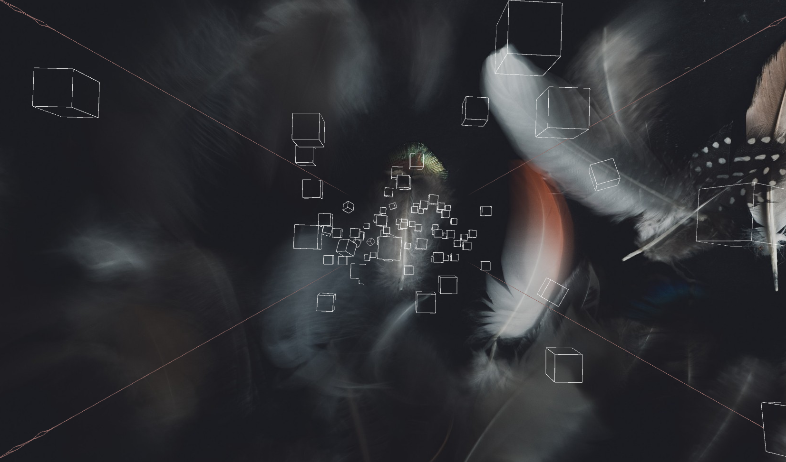

# Processing

    <svg width="400" height="400" viewBox="0 0 800 800" fill="none"><path d="M400 500C700 500 700 100 400 100" stroke="#0468FF" stroke-width="150"></path><path d="M400 200L100 600" stroke="#1F34AB" stroke-width="150"></path><path d="M100 300L200 500" stroke="#85AEFF" stroke-width="150"></path></svg>

**A Collection of Processing Projects.**

## 1.Cube-Music

**Description**

A project of `visualization of music` using elemet included Cube、Line、Image background.

Some vars to tweak with:

 - specLow, specMid and specHi: These values define the ranges of frequencies that will be assigned to each color. 
 - scoreDecreaseRate: Makes the cubes and environnement light out slower if the value is smaller.
 - nbMurs: The number of lines to show on the walls.

**Origin Project**

* https://github.com/alessandrocapra/ProcessingCubes
* https://github.com/tlangerak/ProcessingCubes

